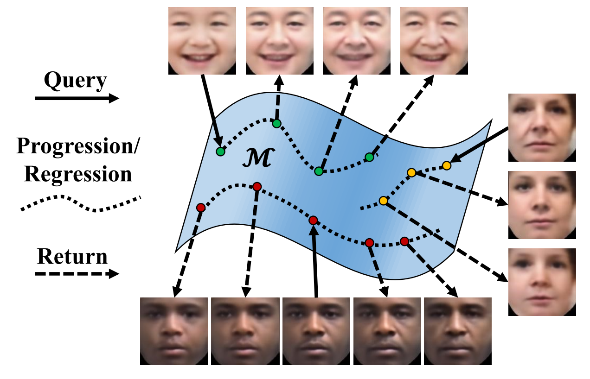
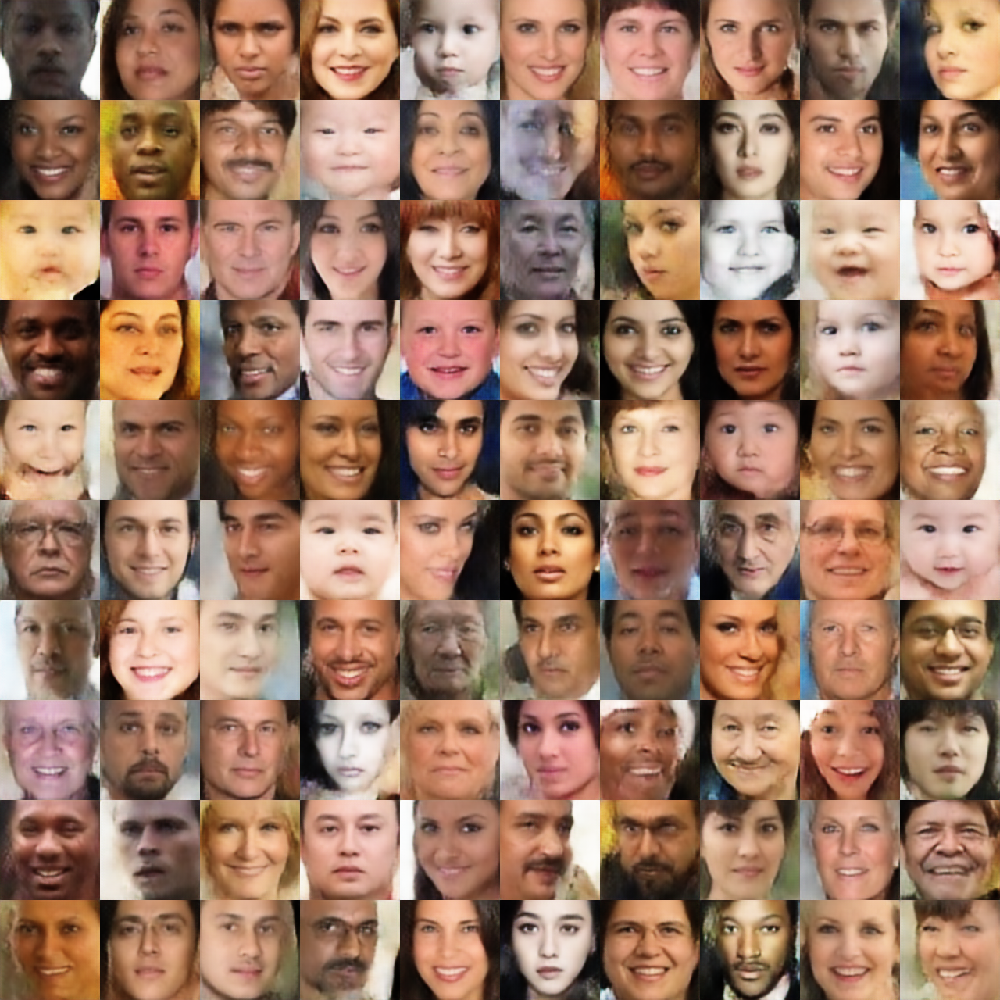
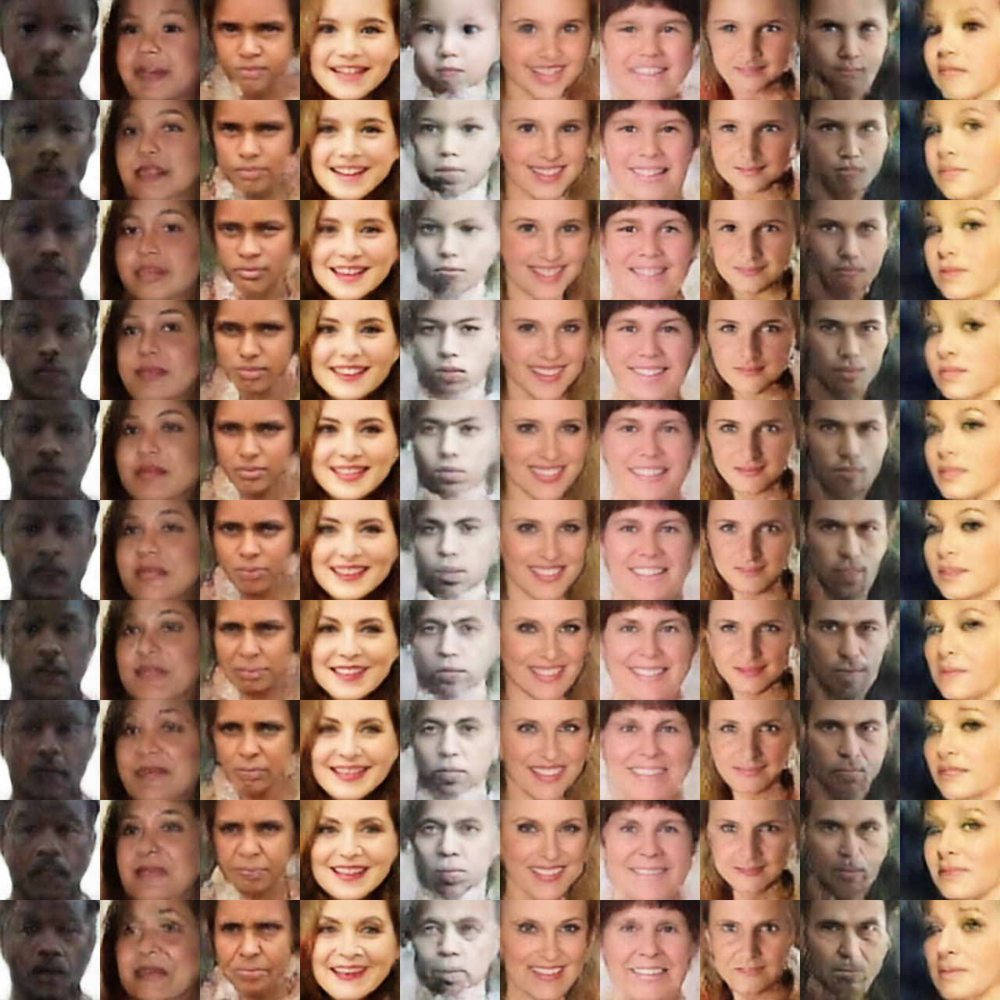

# Age Progression/Regression by Conditional Adversarial Autoencoder (CAAE)

TensorFlow implementation of the algorithm in the paper [Age Progression/Regression by Conditional Adversarial Autoencoder](http://web.eecs.utk.edu/~zzhang61/docs/papers/2017_CVPR_Age.pdf).

Thanks to the [Pytorch implementation](https://github.com/mattans/AgeProgression/tree/v1.0.0) by Mattan Serry, Hila Balahsan, and Dor Alt. 

<p align="center">
  
</p>


## Pre-requisites
* Python 2.7x
* Scipy 1.0.0
* ~~TensorFlow (r0.12)~~
    * ~~Please note that you will get errors if running with TensorFlow r1.0 because the definition of input arguments of some functions have changed, *e.g.*, `tf.concat` and `tf.nn.sigmoid_cross_entropy_with_logits`.~~ 
    
* The code is updated to run with Tensorflow 1.7.0, and an initial model is provided to better initialize the network. The old version is backed up to the folder `old_version`. 

## Datasets
* FGNET
* [MORPH](https://ebill.uncw.edu/C20231_ustores/web/product_detail.jsp?PRODUCTID=8)
* [CACD](http://bcsiriuschen.github.io/CARC/)
* UTKFace (Access from the [Github link](https://susanqq.github.io/UTKFace/) or the [Wiki link](http://aicip.eecs.utk.edu/wiki/UTKFace))

## Prepare the training dataset
You may use any dataset with labels of age and gender. In this demo, we use the UTKFace dataset. It is better to use [aligned and cropped faces](https://drive.google.com/file/d/0BxYys69jI14kYVM3aVhKS1VhRUk/view?usp=sharing). Please save and unzip `UTKFace.tar.gz` to the folder `data`. 

## Training
```
$ python main.py
```

The training process has been tested on NVIDIA TITAN X (12GB). The training time for 50 epochs on UTKFace (23,708 images in the size of 128x128x3) is about two and a half hours.

During training, a new folder named `save` will be created, including four sub-folders: `summary`, `samples`, `test`, and `checkpoint`.

* `samples` saves the reconstructed faces at each epoch.
* `test` saves the testing results at each epoch (generated faces at different ages based on input faces).
* `checkpoint` saves the model.
* `summary` saves the batch-wise losses and intermediate outputs. To visualize the summary, 
```
$ cd save/summary
$ tensorboard --logdir .
```

After training, you can check the folders `samples` and `test` to visualize the reconstruction and testing performance, respectively. The following shows the reconstruction (left) and testing (right) results. The first row in the reconstruction results (left) are testing samples that yield the testing results (right) in the age ascending order from top to bottom.

<p align="center">
    
</p>

The reconstruction loss vs. epoch is shown below, which was passed through a low-pass filter for visualization purpose. The original record is saved in folder `summary`.

<p align="center">
  
</p>

## Custom Training
```
$ python main.py
    --dataset		default 'UTKFace'. Please put your own dataset in ./data
    --savedir		default 'save'. Please use a meaningful name, e.g., save_init_model.
    --epoch		default 50.
    --use_trained_model	default True. If use a trained model, savedir specifies the model name. 
    --use_init_model	default True. If load the trained model failed, use the init model save in ./init_model 
```

## Testing
```
$ python main.py --is_train False --testdir your_image_dir --savedir save
```
**Note**: `savedir` specifies the model name saved in the training. By default, the trained model is saved in the folder save (i.e., the model name).
Then, it is supposed to print out the following message.

```
  	Building graph ...

	Testing Mode

	Loading pre-trained model ...
	SUCCESS ^_^

	Done! Results are saved as save/test/test_as_xxx.png
```

Specifically, the testing faces will be processed twice, being considered as male and female, respectively. Therefore, the saved files are named `test_as_male.png` and `test_as_female.png`, respectively. To achieve better results, it is necessary to train on a large and diverse dataset.

## A demo of training process

The first row shows the input faces of different ages, and the other rows show the improvement of the output faces at every other epoch. From top to bottom, the output faces are in the age ascending order. 

<p align="center">
  
</p>

## Files
* [`FaceAging.py`](FaceAging.py) is a class that builds and initializes the model, and implements training and testing related stuff
* [`ops.py`](ops.py) consists of functions called `FaceAging.py` to implement options of convolution, deconvolution, fully connection, leaky ReLU, load and save images.   
* [`main.py`](main.py) demonstrates `FaceAging.py`.
    
## Citation
[Zhifei Zhang](http://web.eecs.utk.edu/~zzhang61/), [Yang Song](http://web.eecs.utk.edu/~ysong18/), and [Hairong Qi](https://www.eecs.utk.edu/people/faculty/hqi/). "Age Progression/Regression by Conditional Adversarial Autoencoder." *IEEE Conference on Computer Vision and Pattern Recognition (CVPR)*, 2017.
```
@inproceedings{zhang2017age,
  title={Age Progression/Regression by Conditional Adversarial Autoencoder},
  author={Zhang, Zhifei and Song, Yang and Qi, Hairong},
  booktitle={IEEE Conference on Computer Vision and Pattern Recognition (CVPR)},
  year={2017}
}
```
[Spotlight presentation](https://youtu.be/425rPG580dQ)
